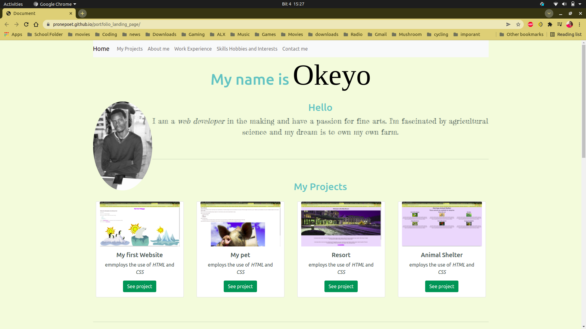

# Portfolio Website
This a is the portfolio website. It tells more about me and my work experience and hobbies and interests.The portfolio includes links to some of the projects I have worked on during the week at Moringa School.

## Technologies Used
- HTML & CSS (Bootstrap)
- FontAwesome Icons

##### Requirements
Internet connection
##### Setup Instructions and Installation
N/A
## Known Bugs
none
##### Link to Live Site : 
[here](https://pronepoet.github.io/portfolio_landing_page/)
### License
MIT Licence